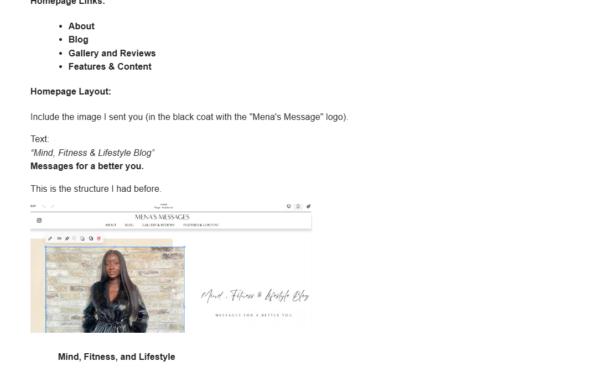
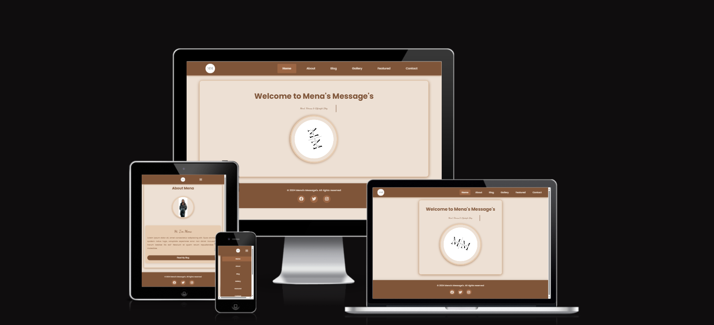

# Mena's Message's 🌟

> A Mind, Fitness & Lifestyle Blog

[](https://html.spec.whatwg.org/)
[](https://www.w3.org/Style/CSS/)
[](https://www.javascript.com/)


## 📑 Table of Contents

- [Overview](#overview)
- [Features](#features)
- [Technologies](#technologies)
- [Getting Started](#getting-started)
- [Deployment](#deployment)
- [Roadmap](#roadmap)
- [Credits](#credits)
- [License](#license)

## 🌟 Overview

Mena's Message's is a responsive blog website focused on mind, fitness, and lifestyle content. The website provides a platform for sharing insights on wellness, personal growth, and healthy living through an engaging and user-friendly interface.

### 📱 Project Preview




## ✨ Features

### Core Features

- **📱 Responsive Design**

  - Fully responsive layout adapting to all screen sizes
  - Mobile-first approach
  - Cross-browser compatibility

- **🎯 Navigation**

  - Intuitive navigation menu
  - Mobile-friendly hamburger menu
  - Skip-to-content link for accessibility

- **💫 Interactive Elements**

  - Animated logo with hover effects
  - Typewriter text effect on homepage
  - Social media integration

- **📝 Content Sections**
  - Blog posts
  - Image gallery
  - Featured content
  - Contact form
  - About page

## 🛠️ Technologies

### Frontend

- **HTML5**

  - Semantic markup
  - Accessibility features
  - SEO-optimized meta tags

- **CSS3**

  - Custom properties (variables)
  - Flexbox & Grid layouts
  - Media queries
  - Animations & transitions

- **JavaScript**
  - Interactive navigation
  - Dynamic content loading
  - Form validation

### External Resources

- Font Awesome (icons)
- Google Fonts (Dancing Script & Poppins)

## 🚀 Getting Started

1. **Local Development**

   ```bash
   git clone <repository-url>
   cd menas-messages
   # Open index.html in your browser
   ```

2. **Navigation Guide**

   - Use the top navigation bar for different sections
   - Access mobile menu via hamburger icon
   - Click logo to return home

3. **Content Interaction**
   - Browse blog posts
   - Explore gallery
   - View featured content
   - Submit contact form

## 📦 Deployment

The website is optimized for deployment on any standard web hosting platform:

- Compatible with modern browsers
- No server-side dependencies
- Static hosting ready

## 🗺️ Roadmap

### Content & Features

#### Newsletter System

- Email subscription functionality
- Automated newsletter distribution
- Personalized content recommendations

#### Enhanced Blog Features

- Content categorization & tagging
- Search functionality
- Reading time estimates
- Related posts
- Comment system

#### User Experience

- Dark/Light theme toggle
- Accessibility improvements
- Offline reading capability
- Social sharing
- Reading progress indicator

### Technical Improvements

#### Performance

- Lazy loading implementation
- Content caching
- Asset optimization
- Modern image formats

#### Analytics & SEO

- Google Analytics integration
- Advanced meta tags
- Sitemap generation
- Schema markup

#### Backend Integration

- CMS implementation
- User authentication
- Database integration
- API development

### Community Features

- User profiles
- Discussion forum
- Content interaction system
- User-generated content
- Fitness tracking tools

## 👏 Credits

- Fonts: [Google Fonts](https://fonts.google.com/) (Dancing Script & Poppins)
- Icons: [Font Awesome](https://fontawesome.com/)
- Images: Original content by Mena's Message's

## 📄 License

All rights reserved © 2024 Mena's Message's

---

> For support or inquiries, feel free to send me a direct message.
